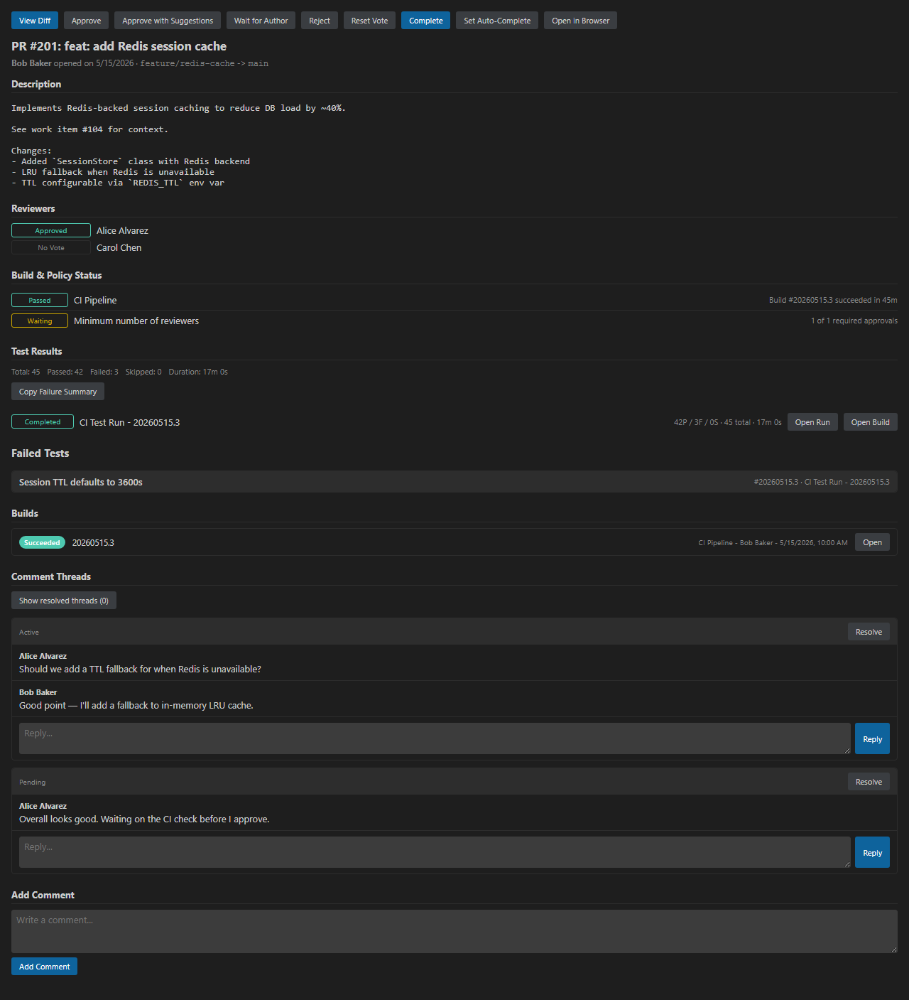
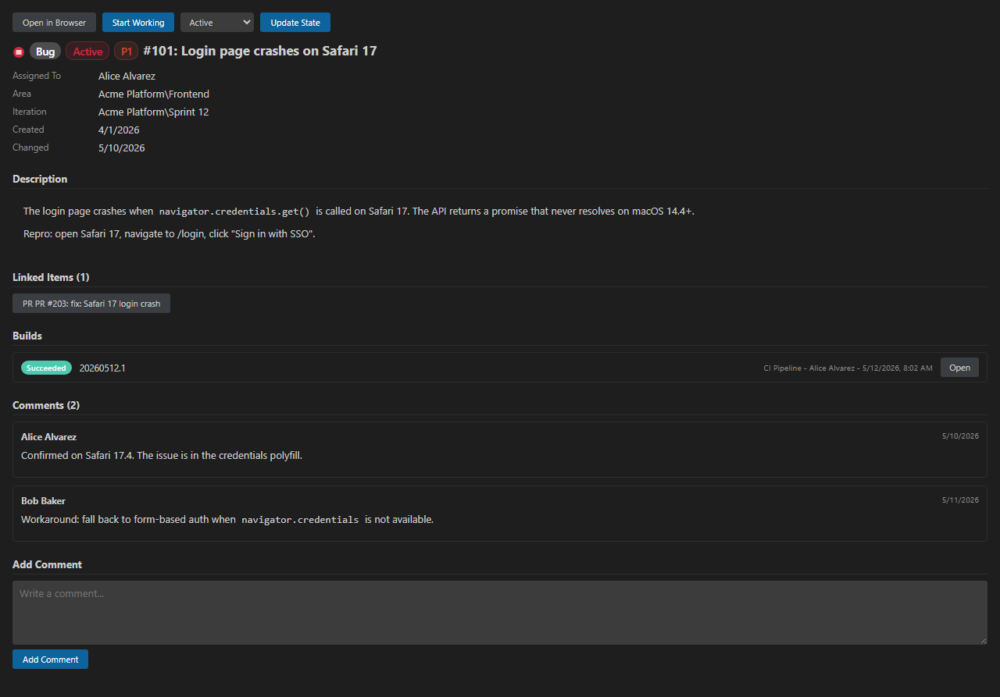
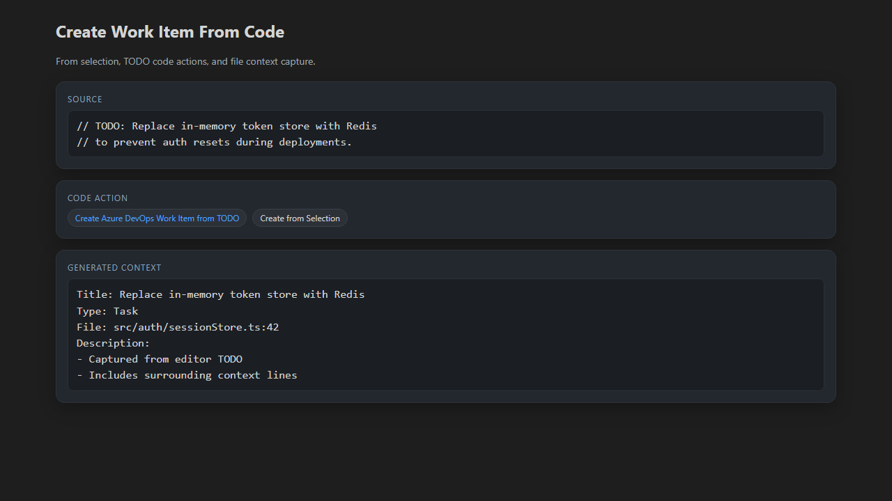
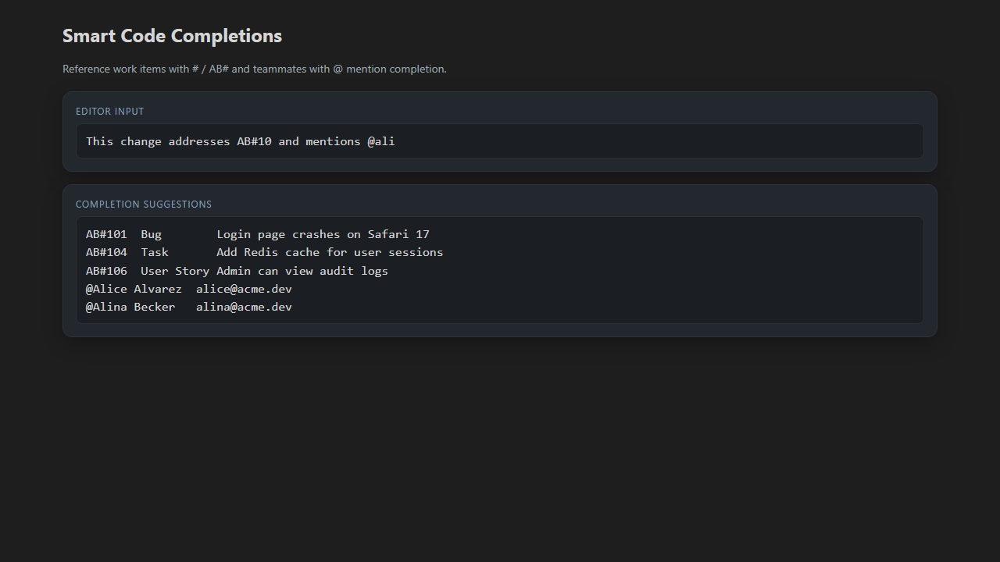
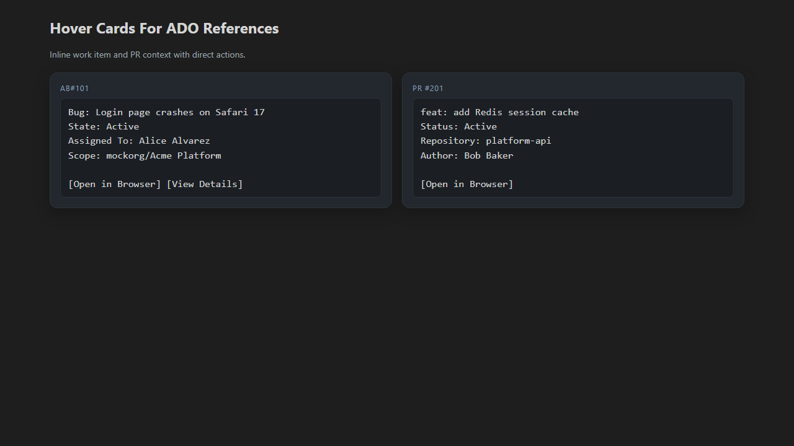
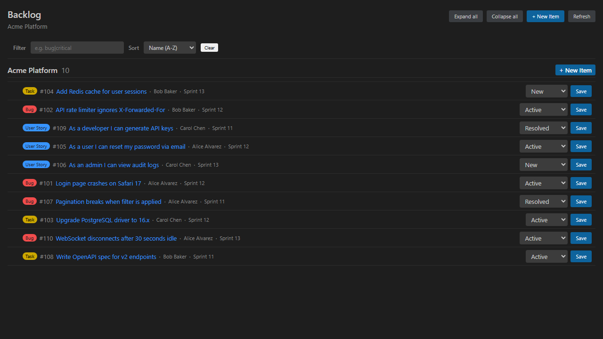
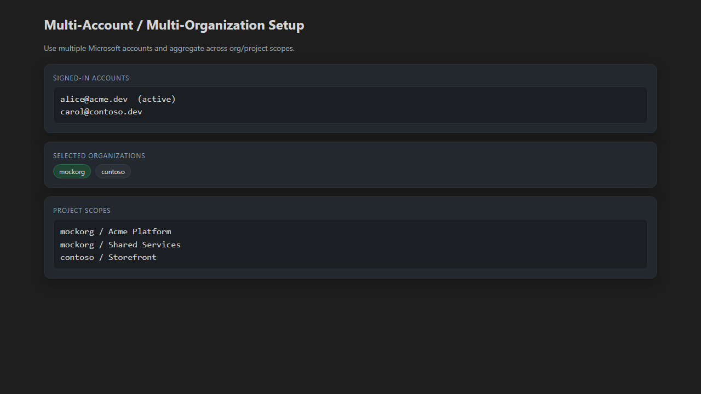
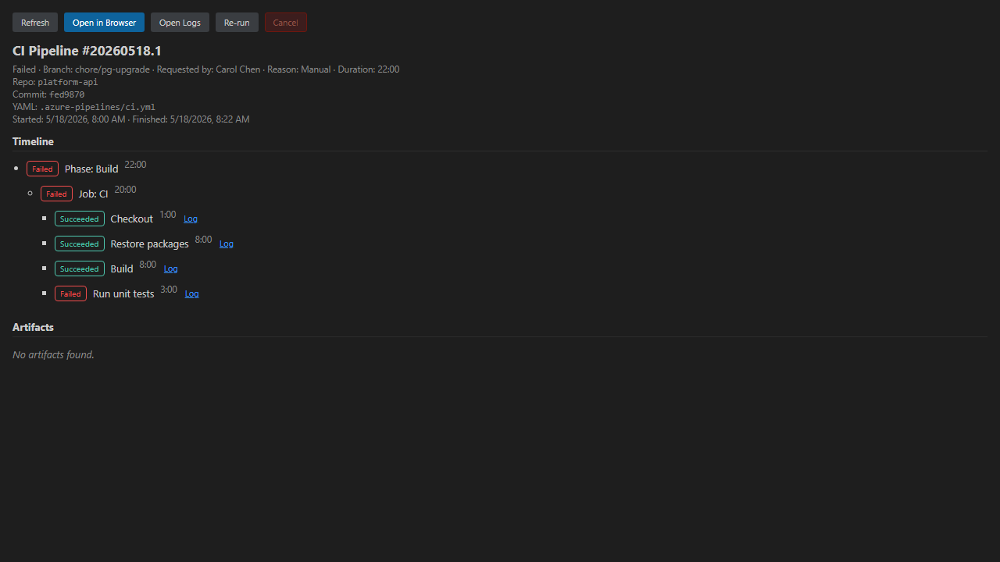

# 🚀 ADOExt — Azure DevOps for VS Code

A full-featured Azure DevOps integration for Visual Studio Code, bringing the power of ADO directly into your editor. Manage work items, pull requests, builds, and team collaboration—all without leaving VS Code.

## UI Preview



_PR details and review workflow directly in VS Code._

## Changelog

See [CHANGELOG.md](CHANGELOG.md) for the full release history.

---

## ✨ Key Features

### 📋 **Work Item Management**



- _Detailed work item editing, discussion, and linked build context in one panel._

- **Browse & Filter** — View work items assigned to you, created by you, or across your entire portfolio
- **Multi-Org Aggregation** — Work items aggregate seamlessly across selected organizations and projects, grouped by project and state
- **Regex Filtering & Sorting** — Filter work items by regex pattern (ID, title) and sort by name or creation date; buttons in the Work Items view header
- **Rich Details Panel** — One-click to open full work item details in a dedicated webview panel
  - Edit title, description, state, priority, assignee, area path, iteration, and tags
  - View and participate in discussion comments
  - See work item history and linked items
  - Open in browser anytime for advanced ADO features
- **ADO-Style Icons** — Custom icons for bugs, tasks, epics, features, stories, PBIs, and issues
- **State Changes** — Change work item state directly from the sidebar

### 🎯 **Create Work Items from Your Code**



- _Turn TODOs and code selections into tracked work with captured editor context._

- **From Selection** — Highlight text in the editor and run `ADOExt: Create Work Item from Selection` to create a new work item with your selected text as the title
- **From TODO Comments** — VS Code code action (💡) appears on TODO comments; click to create a work item directly from the comment
- **File Context** — Work items automatically include the source file path and context lines for quick reference

### 🔍 **Smart Code Completions**



- _Autocomplete work item references and teammate mentions while typing in code, markdown, and commits._

- **Work Item References** — Type `#` or `AB#` in markdown, plaintext, or git commits to see IntelliSense completions for recent work items
  - Shows work item ID, title, type, and state
  - Filter by typing ID digits or title keywords
  - Works with both `#123` and `AB#123` reference formats
- **Team Mentions** — Type `@` to autocomplete team member names from your project
  - Quickly mention colleagues in descriptions, comments, and commit messages
  - Filters by display name and email prefix

### 🎨 **Hover Cards for ADO References**



- _Get instant work item and PR context from inline references, with direct action links._

- **Work Item Hovers** — Hover over `AB#123` or `#123` references in any open file to see a rich detail card
  - Shows title, type, state, assignee, and project scope
  - Quick actions: Open in Browser, View Details panel
- **Pull Request Hovers** — Hover over `PR #123`, `PR!123`, or `!123` to see PR details
  - Shows title, status, repository, and author
  - Quick link to open in browser
- **Smart Scope Resolution** — Hovers work across multi-project setups; when ambiguous, shows the matched scope

### ✅ **Pull Request Management**


- _Review threads, checks, test results, and merge actions in one focused PR workspace._

- **Browse PRs** — View active pull requests (yours, created, assigned to you, all) aggregated across organizations/projects
- **Regex Filtering & Sorting** — Filter PRs by regex pattern (ID, title) and sort by title or creation date; buttons in the Pull Requests view header
- **Inline Review** — Expand PRs in the tree to see all comment threads; reply, resolve, or reopen directly from the sidebar
- **Rich PR Details Panel** — One-click to see full PR information, discussions, and reviewer status
- **Familiar Review UX** — The pull request review flow is inspired by the GitHub Pull Requests and Issues extension for VS Code, adapted for Azure DevOps workflows
- **Native Diff Editor** — Review changes in VS Code's native multi-diff editor (same UX as GitHub PR extension)
  - All changed files visible at once
  - Inline PR comments in the gutter
  - Add new line comments with the `+` affordance
- **Checked-Out Branch** — After running "Checkout Pull Request Branch", existing PR threads light up in your regular editor
- **Smart Notifications** — Toast notifications for new PR comments; configure poll frequency and notification types
- **PR Queries & Buckets** — Organize PRs by review state (Waiting for My Review, Created by Me, All Open) or save custom queries

### 📦 **Backlog, Sprints & Boards**



- _Planning views with fast filtering, state updates, and assignee-aware workflow._

- **Hierarchical Backlog** — View parent/child work item relationships in a collapsible tree
- **Sprint Planning** — Browse work grouped by sprint/iteration with drag-and-drop reordering
- **Regex Filtering & Sorting** — Filter and sort items in Backlog and Sprint views by regex pattern or name/date (controls in the editor view toolbar)
- **Assigned-to-Me Planning Filter** — Toggle Backlog/Sprint/Board trees between all items and items assigned to you
- **Board View** — See work organized by state columns (To Do, In Progress, Done, etc.)
- **Editor Views** — Open Backlog and Board editor views for wider planning layouts
- **State Changes** — Update work item state from planning views; sidebar automatically refreshes
- **Linked Details** — Open any work item from planning views in the shared details panel

### 🔐 **Multi-Account & Multi-Organization**



- _Select multiple accounts, organizations, and project scopes for aggregated cross-team workflows._

- **Built-in Auth** — Uses VS Code's Microsoft authentication (no manual token management)
- **Multiple Accounts** — Sign in with multiple Microsoft accounts and switch seamlessly
- **Organization Picker** — Select one or multiple organizations or all orgs in your account
- **Project Picker** — Choose projects per organization or select all projects
- **Smart Aggregation** — All views (work items, PRs) automatically aggregate across your selection

### 🏗️ **Build & Integration**



- _Pipeline run diagnostics, timeline details, and quick actions without leaving the editor._

- **Build Summaries** — Lightweight build status cards in PR and work item detail panels
- **Pipelines View** — Browse recent Azure Pipelines runs across selected scopes; filter/group runs, inspect timeline details, open step logs from the tree or details timeline in VS Code, and open artifacts
- **MCP Server** — Official Azure DevOps MCP integration with shared configuration and auth options
- **Azure Boards Integration** — Full WIQL query support for advanced filtering and bulk operations

---

## 📥 Installation

**From VS Code Marketplace:**
1. Open VS Code
2. Go to Extensions (Ctrl+Shift+X / Cmd+Shift+X)
3. Search for "ADOExt"
4. Click Install

**From Source:**
```bash
git clone https://github.com/sthach-philips/ADOExt
cd ADOExt
pnpm install
pnpm run compile
code --install-extension ./adoext-<version>.vsix
```

---

## 🚀 Quick Start

### 1. **Sign In**
   - Open the Command Palette (Ctrl+Shift+P / Cmd+Shift+P)
   - Run `ADOExt: Sign In`
   - Authenticate with your Microsoft account

### 2. **Select Organization**
   - Run `ADOExt: Select Organization`
   - Choose your Azure DevOps organization(s)

### 3. **Select Projects**
   - Run `ADOExt: Select Project`
   - Choose project(s) to work with

### 4. **Explore the Sidebar**
   - **Work Items** — Browse assigned, created, and all work items
   - **Pull Requests** — View PRs organized by bucket (Waiting for Review, Created by Me, All Open)
   - **Backlog** — Hierarchical view of all work
   - **Sprints** — Current and future sprint planning
   - **Boards** — Kanban-style board view
  - **Pipelines** — Recent CI/CD runs across your selected scopes

---

## ⚙️ Configuration

Open VS Code Settings (Ctrl+, / Cmd+,) and search for `adoext` to customize:

### Authentication

| Setting | Description | Default |
|---------|-------------|---------|
| `adoext.authMethod` | Auth method: `vscode`, `msal`, `azcli`, or `pat` | `"vscode"` |

### Organization & Projects

| Setting | Description | Default |
|---------|-------------|---------|
| `adoext.projectsByOrganization` | Multi-org project selection map | `{}` |

### Work Items

| Setting | Description | Default |
|---------|-------------|---------|
| `adoext.workItemQueries` | Saved work item query definitions | (defaults) |
| `adoext.workItemFilterRegex` | Regex filter for work item titles | `""` |
| `adoext.workItemSortOrder` | Sort by `name` or `date` | `"name"` |
| `adoext.workItemHideStates` | States to hide (e.g. `["Done", "Removed"]`) | `[]` |
| `adoext.workItemQueryLimit` | Max items fetched per scope | `200` |

### Pull Requests

| Setting | Description | Default |
|---------|-------------|---------|
| `adoext.pullRequestQueries` | Saved PR bucket definitions | (defaults) |
| `adoext.pullRequestFilterRegex` | Regex filter for PR titles | `""` |
| `adoext.pullRequestSortOrder` | Sort by `title` or `date` | `"title"` |
| `adoext.pullRequestLimit` | Max PRs fetched per scope | `100` |
| `adoext.showResolvedPullRequestThreads` | Show resolved comment threads | `true` |
| `adoext.hideSystemPullRequestThreads` | Hide system-generated threads | `true` |

### Planning (Backlog, Sprints, Boards)

| Setting | Description | Default |
|---------|-------------|---------|
| `adoext.planningViews` | Configurable filters, sections, and toolbar per view | (defaults) |
| `adoext.planningAssignedFilter` | Show `all` items or only `mine` | `"all"` |
| `adoext.planningQueryLimit` | Max items per WIQL query | `500` |
| `adoext.planningTotalLimit` | Hard cap including recursive parents | `1000` |
| `adoext.fuzzySearchThreshold` | Fuse.js threshold for title search (0=exact, 1=any) | `0.4` |

### Pipelines

| Setting | Description | Default |
|---------|-------------|---------|
| `adoext.pipelineRunsFilter` | Filter: `all`, `running`, `failed`, or `mine` | `"all"` |
| `adoext.pipelineRunsGroupBy` | Group by `none`, `repository`, or `branch` | `"none"` |
| `adoext.pipelineRunsTop` | Max runs fetched per scope | `25` |

### Notifications

| Setting | Description | Default |
|---------|-------------|---------|
| `adoext.notifyOnNewPullRequestComments` | Toast on new PR comments | `true` |
| `adoext.notifyOnPullRequestReviewRequests` | Toast when added as reviewer | `true` |
| `adoext.notifyOnPullRequestStatusChanges` | Toast on reviewer votes | `true` |
| `adoext.pullRequestCommentPollIntervalSeconds` | Poll interval for notifications | `300` |

---

## 🔌 MCP Server Integration

ADOExt integrates with the official [Microsoft Azure DevOps MCP server](https://github.com/microsoft/azure-devops-mcp) (`@azure-devops/mcp`).

Use `ADOExt: Copy MCP Server Configuration` to generate a ready-to-paste `.vscode/mcp.json` entry for interactive auth, bearer token (`ADO_MCP_AUTH_TOKEN`), or PAT (`PERSONAL_ACCESS_TOKEN`) setups.

---

## 🎯 Commands

All commands are available via the Command Palette (Ctrl+Shift+P / Cmd+Shift+P) under the "ADOExt" category.

### Account & Setup

| Command | Purpose |
|---------|---------|
| `Sign In to Azure DevOps` | Authenticate with Microsoft |
| `Sign Out from Azure DevOps` | Sign out and clear session |
| `Select Organization` | Choose organization(s) |
| `Select Project` | Choose project(s) |
| `Detect Repository Context from Workspace` | Auto-detect org/project from git remote |

### Work Items

| Command | Purpose |
|---------|---------|
| `Create Work Item` | Create a new work item interactively |
| `Create Work Item from Selection` | Create work item from highlighted text |
| `Create Work Item from TODO Comment` | Create work item from a TODO in code |
| `Open Saved Query` | Browse and open saved WIQL queries |
| `View Work Item Details` | Open work item in details panel |
| `Change Work Item State` | Transition work item to a different state |
| `Start Working` | Create a branch for a work item |
| `Filter Work Items` | Set regex title filter |
| `Sort Work Items` | Toggle sort by name or date |
| `Toggle Hide Done Work Items` | Show/hide completed items |
| `Refresh Work Items` | Manually refresh tree |

### Pull Requests

| Command | Purpose |
|---------|---------|
| `View Pull Request Details` | Open PR in details panel |
| `View Pull Request Diff` | Open native multi-diff editor |
| `Checkout Pull Request Branch` | Check out PR branch locally |
| `Approve Pull Request` | Vote approve |
| `Approve Pull Request with Suggestions` | Vote approve with suggestions |
| `Wait for Pull Request Author` | Vote wait for author |
| `Reject Pull Request` | Vote reject |
| `Reset Pull Request Vote` | Clear your vote |
| `Add Comment to Pull Request` | Add a top-level PR comment |
| `Show/Hide Resolved PR Threads` | Toggle resolved thread visibility |
| `Filter Pull Requests` | Set regex title filter |
| `Sort Pull Requests` | Toggle sort by title or date |
| `Refresh Pull Requests` | Manually refresh tree |

### Planning (Backlog, Sprints, Boards)

| Command | Purpose |
|---------|---------|
| `Open Backlog in Editor` | Wide editor view for backlog |
| `Open Sprint in Editor` | Wide editor view for sprint |
| `Open Board in Editor` | Wide editor view for board |
| `Filter Planning Items by Assignee` | Toggle all / assigned to me |
| `Filter by Area Path` | Set area path filter |
| `Filter by Iteration` | Set iteration filter |
| `Filter by Work Item Type` | Set type filter |
| `Filter by Title` | Set fuzzy title filter |
| `Configure Sections` | Group board columns by state |
| `Configure Global Filter` | Edit the shared planning filter |

### Pipelines

| Command | Purpose |
|---------|---------|
| `View Pipeline Run Details` | Open run in details panel |
| `Filter Pipeline Runs` | Filter by all/running/failed/mine |
| `Group Pipeline Runs` | Group by none/repository/branch |
| `Re-run Pipeline` | Trigger a new run of the same pipeline |
| `Cancel Pipeline Run` | Cancel a running/queued pipeline |
| `Open Step Log` | View step log output in editor |
| `Refresh Pipelines` | Manually refresh tree |

### MCP & Utilities

| Command | Purpose |
|---------|---------|
| `Copy MCP Server Configuration` | Generate `.vscode/mcp.json` entry |
| `Show MCP Server Info` | Display MCP server status |
| `Show Output` | Open the ADOExt output channel |

---

## 📋 Requirements

- **VS Code** 1.101.0 or later
- **Git** (for PR branch checkout)
- **Azure DevOps Account** with at least read access to your organization
- **Microsoft Authentication** in VS Code (built-in; uses existing sign-in)

---

## 🤝 Contributing

We welcome contributions! Please feel free to open issues or pull requests on [GitHub](https://github.com/sthach-philips/ADOExt).

### Development Setup
```bash
git clone https://github.com/sthach-philips/ADOExt
cd ADOExt
pnpm install
pnpm run compile      # Build extension TypeScript and webview bundles
pnpm run watch        # Watch extension TypeScript
pnpm run watch:webviews # Watch bundled webview assets
code .                # Open in VS Code for testing
```

#### First-time Setup (after install)

1. Set your auth method in VS Code settings (`adoext.authMethod`):
   - `"vscode"` -- default, uses VS Code's built-in Microsoft auth
   - `"azcli"` -- recommended for WSL (requires `az login` first)
   - `"msal"` -- MSAL interactive OAuth (same flow as @azure-devops/mcp)
   - `"pat"` -- reads `AZURE_DEVOPS_PAT` from environment

2. Run from the command palette:
   - `ADOExt: Sign In`
   - `ADOExt: Select Organization`
   - `ADOExt: Select Project`

The org/project selection is required even if you set values in `settings.json`.

#### Environment (optional, for MCP server and PAT auth)

Copy the example and fill in via [pass](https://www.passwordstore.org/) + [direnv](https://direnv.net/):
```bash
cp .envrc.example .envrc
direnv allow
```

For `azcli` auth, ensure you have the Azure CLI installed and run:
```bash
az login
az account get-access-token --resource 499b84ac-1321-427f-aa17-267ca6975798  # verify ADO access
```

---

## 📝 License

This extension is open source and available under the [MIT License](LICENSE).

---

## 🐛 Feedback & Support

Found a bug or have a feature request? [Open an issue](https://github.com/sthach-philips/ADOExt/issues) on GitHub.

Happy coding! 🎉
